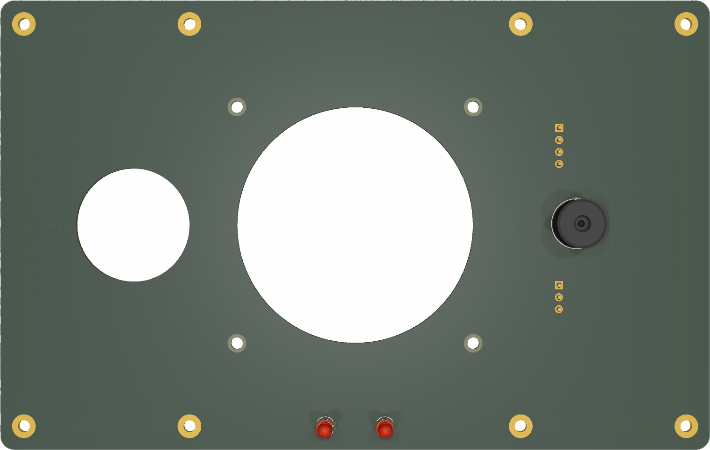

# YAORP
 
## Yet Another Open Reflow Plate

A design for a solder reflow plate for SMD rework using commonly available aluminium 400W PTC (positive-temperature-coefficient) heating plate from AliExpress. Temperature is
determined using a K type thermocouple and read using a MAX6675/MAX31855. The PTC is driven by an SSR (solid state relay) using PWM and controlled by a PID. An ESP32 S3 Wroom 1 module is at the heart of the design and firmware is written in C++ for Arduino IDE.

Two PCBs have been designed using KiCAD 8. The main controller board (board 1) and a cooling plate/heat dissipator (board 2).

Project status: Prototype (untested in its built form).

