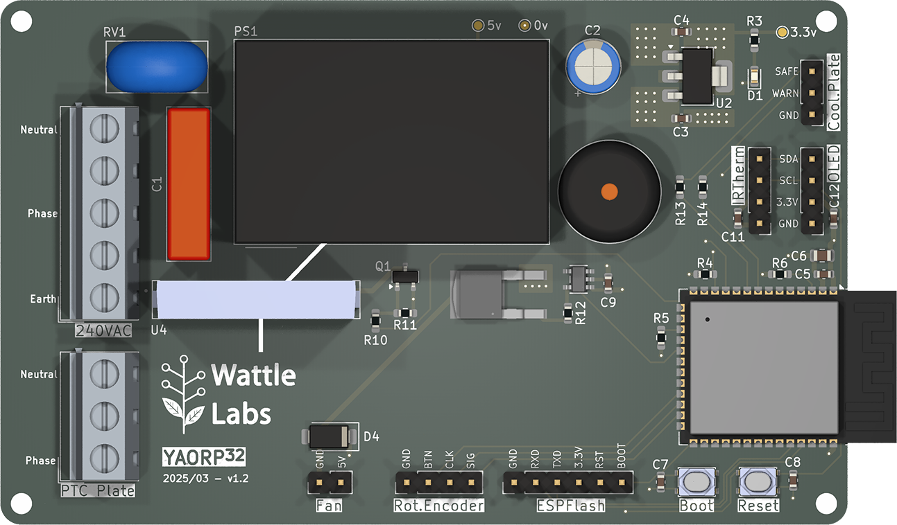

# YAORP (Yet Another Open Reflow Plate)

## Status:

Tested an initial v1.0 board. Various improvements and bug fixes applied to produce rev 1.2 (build pending). Basic PoC firmware written.

## Introduction:

A design for a solder reflow plate for SMD rework using commonly available aluminium 240V AC 400W PTC (positive temperature coefficient) heating plate from AliExpress.

PTC temperature is determined using an infrared thermometer (MLX90614). The PTC is driven by an SSR (solid state relay) using PWM (pulse width modulation), and controlled by a PID (proportional integral derivative).

An ESP32 S3 Wroom 1 module forms the heart of the design and firmware is written in C++ for Arduino IDE. 

Two PCBs have been designed using KiCAD 9. The main controller board (board 1) and a cooling plate/heat dissipator (board 2).

## Project Goals:

- Enhance my knowledge of electronics. 
- Learn KiCad.
- Make the move away from hand soldered components.
- Build a useful addition to my lab.
- Make it as professional as possible.

